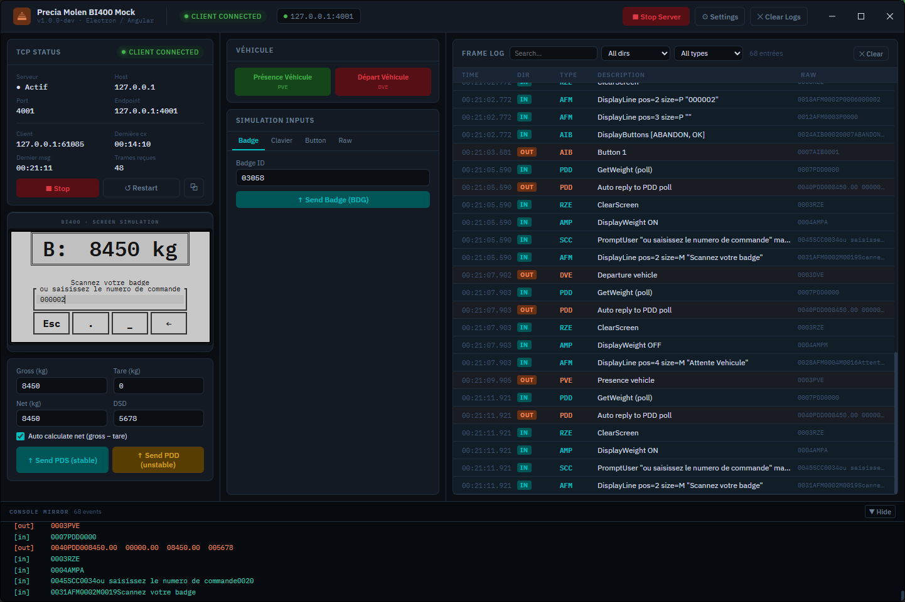

# PreciaMocken

Simulateur de borne de pont-bascule **Precia Molen BI400** — application Electron + Angular simulant le terminal industriel pour tester et développer sans matériel physique.



## Ce que fait l'application

PreciaMocken émule le comportement d'un terminal BI400 connecté en TCP. Il permet de :

- **Simuler le terminal LCD** — affiche en temps réel les trames reçues (texte AFM, poids, choix de boutons AIB, invites de saisie SCC)
- **Envoyer des commandes** — badge, texte (Clavier), boutons AIB, trames brutes
- **Gérer le poids** — configurer brut/tare/net, envoyer en stable (PDS) ou instable (PDD), auto-réponse aux polls
- **Gérer les véhicules** — présence (PVE) et départ (DVE) ; un DVE est envoyé automatiquement à chaque connexion client
- **Journaliser** — historique des trames et console TCP en temps réel

### Protocole supporté

L'application implémente le protocole BI400 (TCP, trames préfixées par 4 caractères de longueur) :

| Trame | Description |
|-------|-------------|
| PVE / DVE | Présence / Départ véhicule |
| PDS / PDD | Poll poids stable / instable (auto-répondu) |
| BDG | Lecture de badge |
| SCC | Invite de saisie clavier |
| AIB | Affichage de boutons de choix |
| AFM | Affichage d'une ligne de texte |
| AMP | Afficher/masquer le cadre poids |
| RZE | Effacement complet de l'écran |
| RZP | Effacement partiel |

## Lancer en développement

```bash
npm install
npm run dev
```

Ouvre Angular sur `http://127.0.0.1:4200` et lance Electron en parallèle.

## Build de production

```bash
npm run build
```

Compile Angular (`dist/`) et Electron (`dist-electron/`) dans le dossier de sortie.

## Distribuer

```bash
npm run dist
```

Génère un installable via `electron-builder` (configuré dans `package.json`).

## Stack technique

- **Electron 41** + **Angular 21** (standalone components, signals)
- **TypeScript** throughout (strict mode)
- Communication IPC via `contextBridge` / `preload`
- Serveur TCP natif (`node:net`) pour le protocole BI400

## Licence

MIT — voir [LICENSE](LICENSE).
